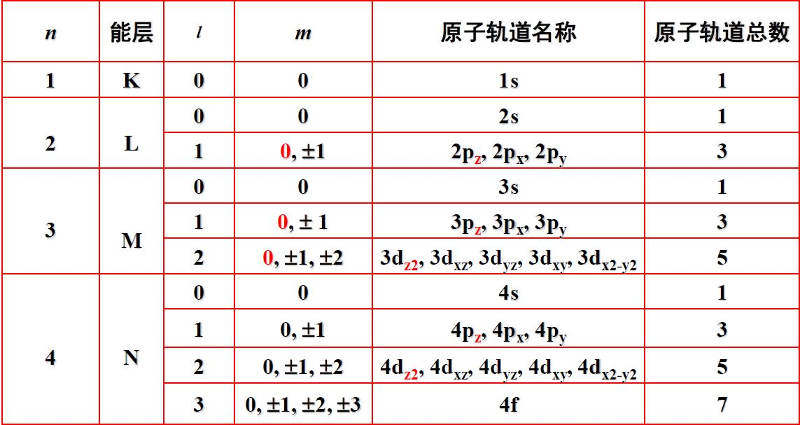
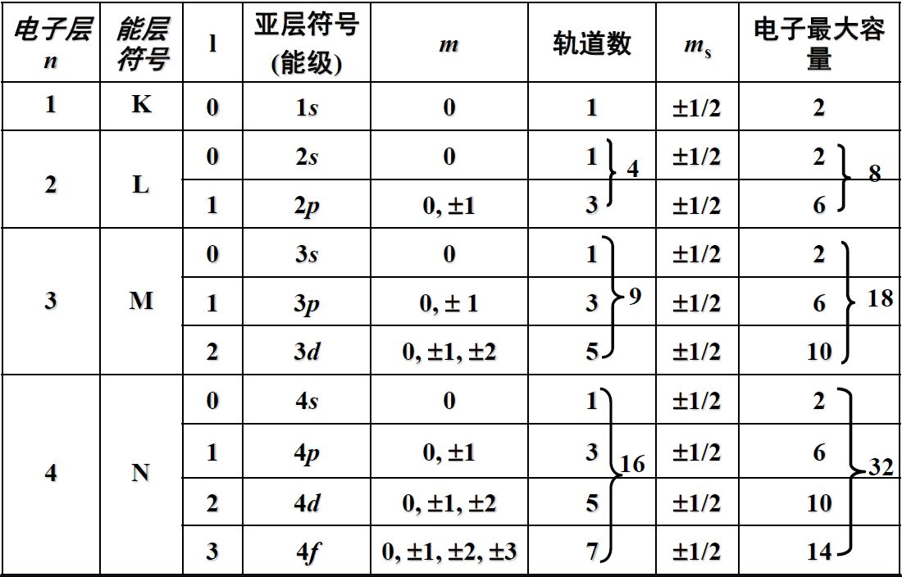
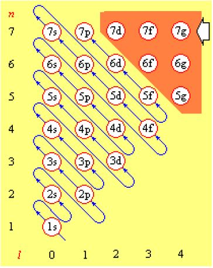
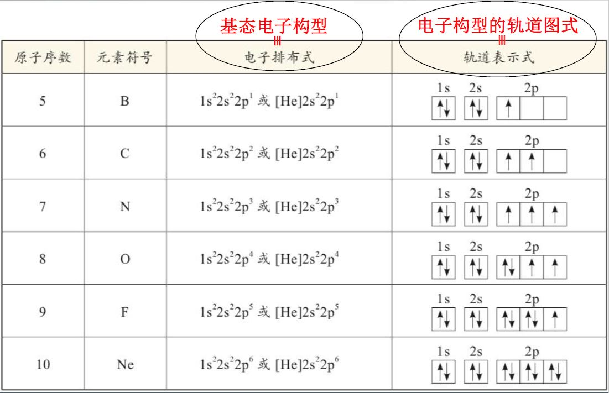

## 原子的量子力学模型

- 径函数，由n, l决定；角函数，由l, m决定。

​		n为主量子数，n=1, 2, 3, ...

​		l为角量子数，l=0 (s), 1 (p), 2 (d), 3 (f), ..., n-1

​		m为磁量子数，m=0, ±1, ±2, ..., ±l

- 对于径函数R(r)

  径节面指径函数为零的地方，径节面数=n-l-1

  $R^2(r)$是电子沿径向出现的概率密度

- 对于角函数$Y(\theta, \phi)$

  只取决于l和m，而与n无关

  $Y(\theta, \phi)$是电子沿角向出现的概率密度

  角节面数=l

  总节面数=n-1

- 小结

  主量子数n决定电子的能量和电子距离核的远近

  角量子数l决定电子轨道的形状

  磁量子数m决定角动量的分量大小

## 多电子原子结构

基态：原子处于能量最低的状态，电子排布是唯一的

激发态：电子的排布不是唯一的

构造原理：按照核内加一个质子、核外加一个电子的方式逐渐构建原子，新增加的核外电子将按以下顺序陆续填满各个原子轨道。

> (1s)(2s2p)(3s3p)(4s3d4p)(5s4d5p)(6s4f5d6p)(7s5f6d7p)

- 排布规则
  1. 泡利不相容原理——原子中不存在四个量子数完全相同的两个电子，每个轨道最多接纳两个自旋相反的电子
  2. 能量最低原理——不违反泡利不相容原理的前提下，电子总是先进入能量最低的轨道
  3. 洪特规则
     1. 填充主量子数和角量子数相同的各个轨道时，电子总是先按自旋平行的方式占有各个轨道
     2. 轨道处于半满或全满的状态时，体系能量低

顺磁性：具有不成对电子成单电子、不成对电子数越多，原子或离子的顺磁性越大

