## 离子键

离子键：原子间通过正、负离子电性吸引的互相作用称为离子键

- 离子键的本质时静电引力（库仑力）

  - 离子电荷越大，间距越小，引力越大，离子键越强
  - 无方向性、无饱和性
  - 电负性差值越大，键的离子性越大
  - 阴离子：大球；阳离子：小球

- 离子键的强度

  晶格能（U）：气态离子形成1mol离子晶体的过程释放的能量

  影响因素：离子间距，离子电荷数，晶体类型

  晶格能越大，硬度越大，熔点越高

- 离子半径

  正离子的离子半径比同一元素的原子半径小

  负离子的原子半径比同一元素的原子半径大
  
- 波恩-哈勃循环

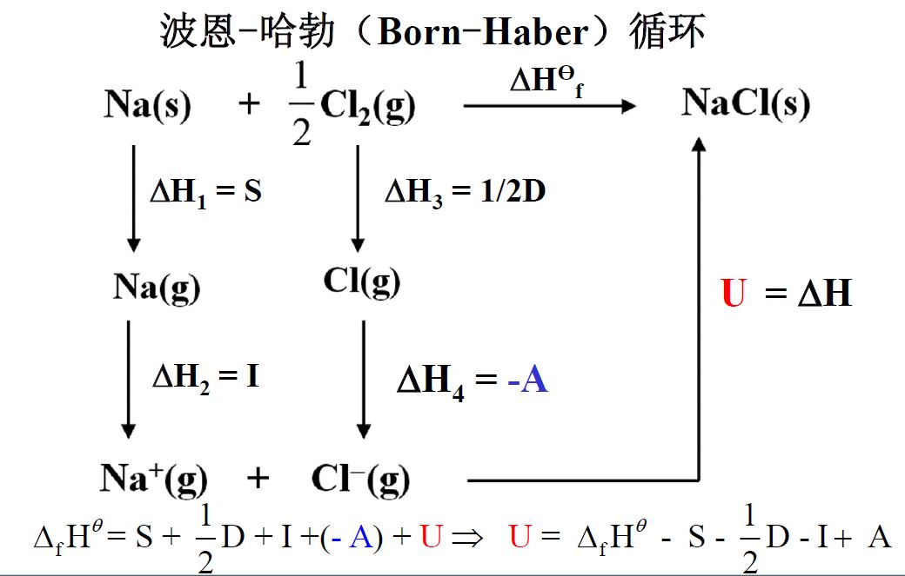

## 共价键

#### 经典路易斯学说

原子通过共用电子对形成的化学键称为**共价键**

两个成键原子的核间距离称为**键长**，原子之间的共享电子对数目称为**键级**

键角：分子中键与键之间的夹角

**极性共价键**：成键电子对在其中一个原子周围出现几率大的共价键

**非极性共价键**：没有极性

#### 价键理论

形成共价键的两个必要条件

1. 2个原子的夹层轨道上有不成对电子，自旋相反
2. 2个原子轨道必须有最大程度的重叠

共价键的本质：原子相互接近时轨道重叠，原子通过共用电子对使能量降低而成键

共价键的特点：饱和性（不成对电子用完了，就不能再形成共价键）和方向性（形成的共价键会有一定的角度）

共价键的类型：

- $\sigma$键：头碰头
- $\pi$键：肩并肩，没有$\sigma$键稳定

简单的价键理论不能解释分子的空间构型

#### 杂化轨道理论

需要掌握*外轨型杂化轨道*

- $sp$杂化轨道：两个$sp$杂化轨道互成180° ，直线型（激发-杂化）

- $sp^2$杂化轨道：1个ns轨道和2个np轨道组成三个$sp^2$杂化轨道，夹角为120°，平面三角形

- $sp^3$杂化轨道：1个ns轨道和3个np轨道组成四个$sp^2$杂化轨道，夹角为109°28‘，四面体

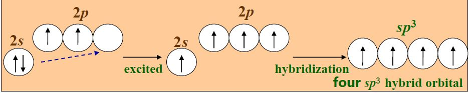

- $sp^3d$杂化轨道：1个ns轨道、3个np轨道和1个nd轨道组合成5个能量相等的$sp^3d$杂化轨道，夹角为90°、120°，三角双锥

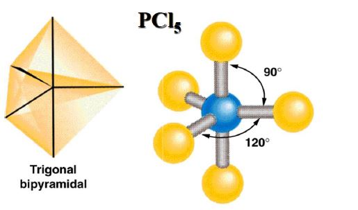

- $sp^3d^2$杂化轨道：1个ns轨道、3个np轨道和2个nd轨道组成6个能量相等的$sp^3d^2$杂化轨道，夹角为90°，八面体

  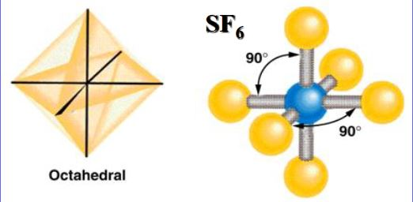

- 乙烯分子：一个$\sigma$键，一个$\pi$键

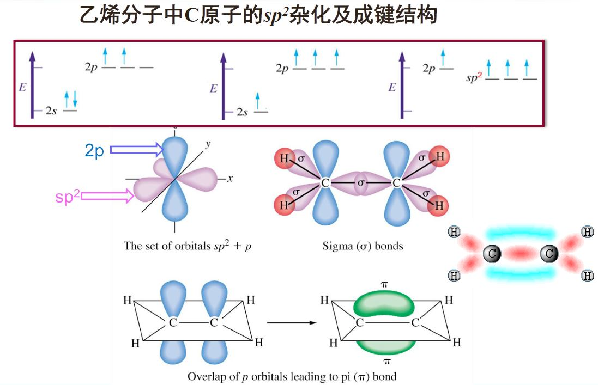

​	乙炔分子：一个$\sigma$键，两个$\pi$键

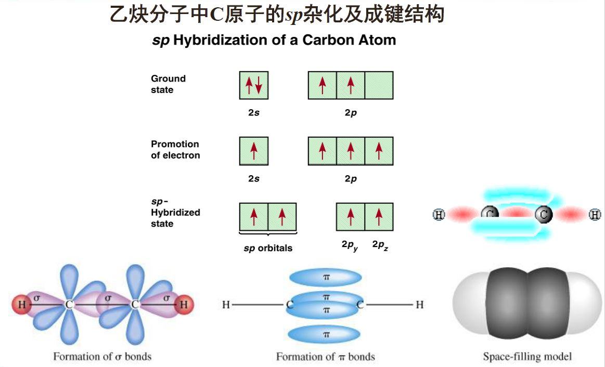

- 杂化轨道随着s成分的增加键能增大键长减小
- 杂化轨道分为*等性*（成键）和*不等性*（成键+孤对电子）杂化轨道两种

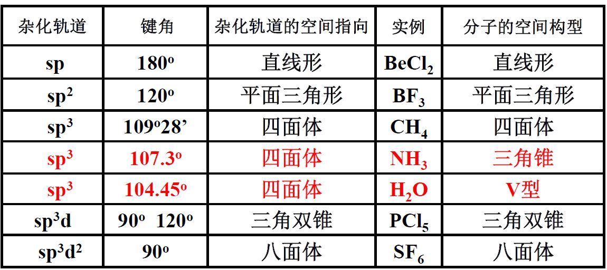

#### 价层电子对互斥理论

#### 分子轨道理论

- 要点
  1. 分子中，电子不再属于单个原子
  2. 分子轨道近似由原子轨道线性组合形成
  3. 满足
     1. 泡利原理：每个轨道最多容纳2个自旋相反的电子
     2. 能量最低原理：能量较低的轨道填满之后，才能填入能量较高的轨道
     3. 洪特规则：当电子填入2个以上等能量轨道时，电子总是先以自旋相同的方式占据这些轨道直到半充满。
- 两个原子的原子轨道线性组合形成两个分子轨道
  - 成键分子轨道：能量低，电子云密度大
  - 反键电子轨道：能量高，电子云密度为零
  - 波函数叠加，相位相同波增强，能量降低。

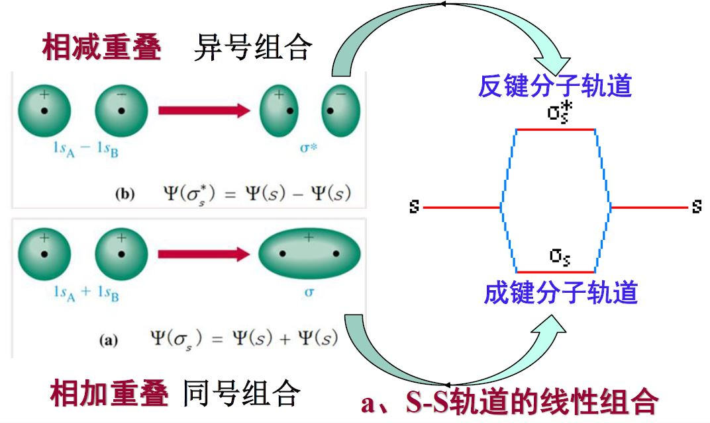

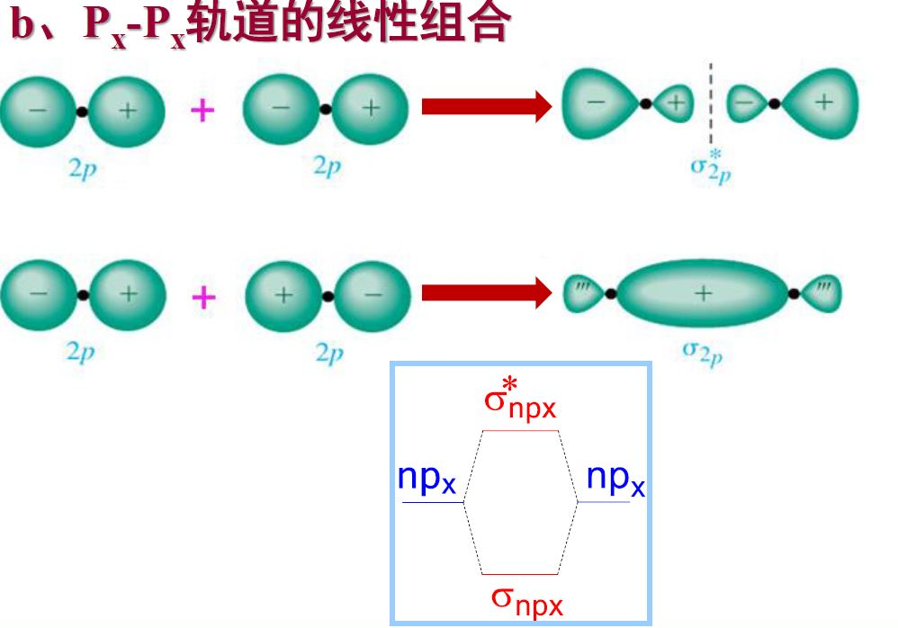

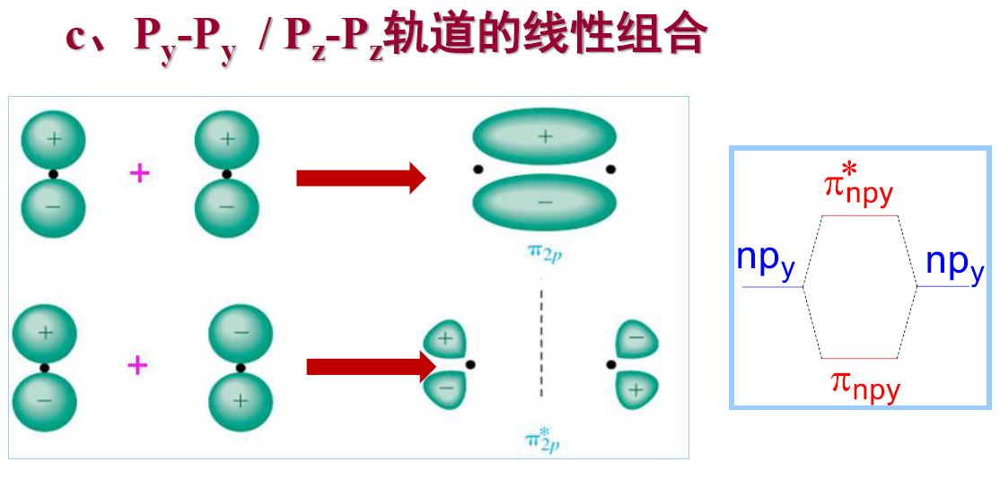

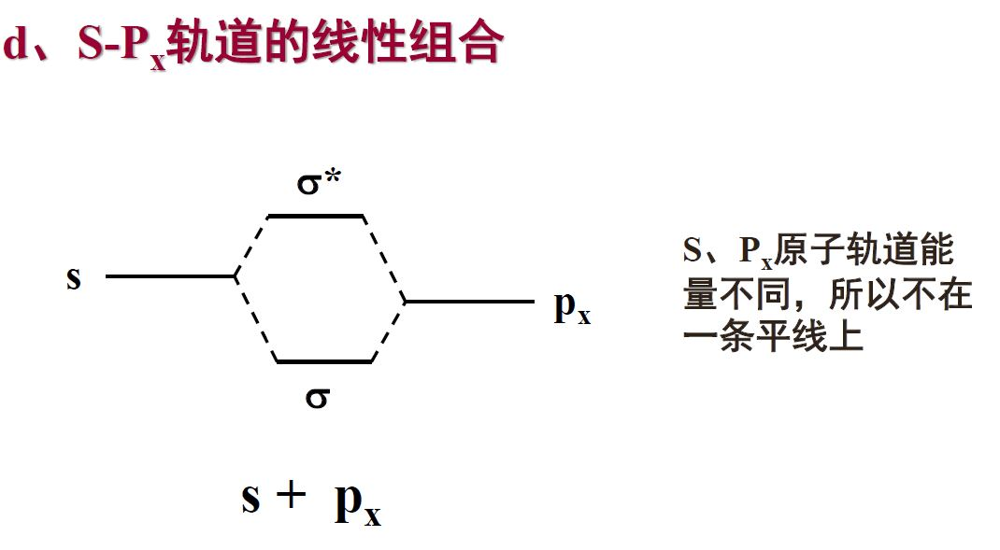

- 原子轨道线性组合的原则
  - 能量匹配原则：只有能量相近的原子轨道之间可以进行线性组合
  - 对称性匹配原则
    - 对称轨道：s-s，px-px （$\sigma$轨道）
    - 反对称轨道：px-py （$\pi$轨道）
  - 最大重叠原则
    - 键级=$\dfrac{成键电子数-反键电子数}{2}$
    - 键级越高，键能越大，键长越短
- 同核双原子分子
  - 有单电子，有顺磁性
  - 键级不是0，就能稳定存在
  - 详见ppt

#### 分子间作用力

- 分子与分子之间存在一种比化学键弱得多的相互作用力

  - 短程作用，对距离非常敏感
  - 无方向性和饱和性

- 分子的极性

  - 同核双原子分子：非极性键
  - 异核双原子分子：极性键
  - 结构对称的多原子分子，键有极性，分子没有极性

- 分子间作用力

  - 取向力（刻松力）
    - 极性分子与极性分子之间的作用力
  - 诱导力（德拜力）
    - 极性分子与非极性分子之间的作用力，使非极性分子有极性
    - 极性分子与极性分子之间也会有
  - 色散力（伦敦力）
    - 核外电子不断运动的过程中产生的正负电荷重心分离，产生瞬时偶极
  - 氢键
    - 存在于分子之间和分子之内的作用力
    - 分子中与高电负性原子X以共价键相连的H原子与另一分子中一个高电负性原子Y之间形成的弱键
    - N、O、F的氢化物分子
    - 氢键的强弱与X，Y的电负性与大小密切相关
    - 分子内氢键降低沸点，分子间氢键升高沸点

  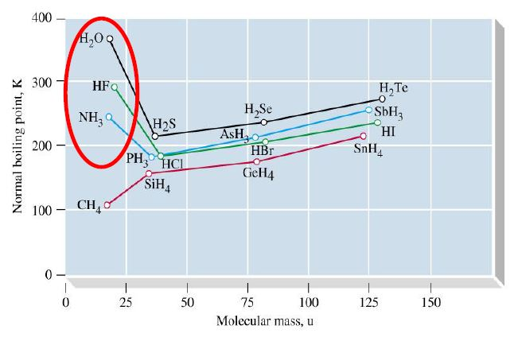

  - 大部分分子间作用力以色散力为主
    - 非极性分子，分子间色散力随分子量增加而加强
    - 稀有气体，水分子与稀有气体间的诱导力随分子量增加而增大

