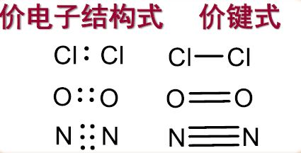
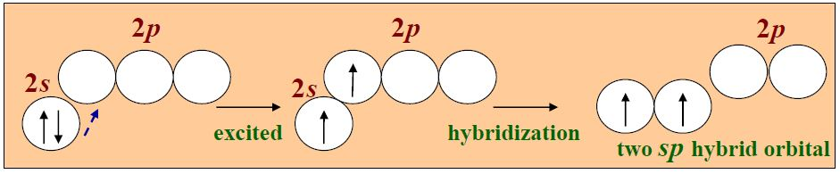
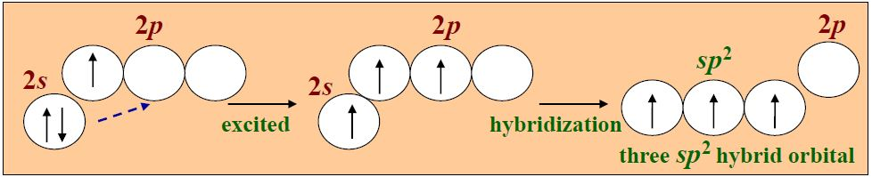

## 离子键

离子键：原子间通过正、负离子电性吸引的互相作用称为离子键

- 离子键的本质时静电引力（库仑力）

  - 离子电荷越大，间距越小，引力越大，离子键越强
  - 无方向性、无饱和性
  - 电负性差值越大，键的离子性越大
  - 阴离子：大球；阳离子：小球

- 离子键的强度

  晶格能（U）：气态离子形成1mol离子晶体的过程释放的能量

  影响因素：离子间距，离子电荷数，晶体类型

  晶格能越大，硬度越大，熔点越高

- 离子半径

  正离子的离子半径比同一元素的原子半径小

  负离子的原子半径比同一元素的原子半径大

## 共价键

#### 经典路易斯学说

原子通过共用电子对形成的化学键称为**共价键**

两个成键原子的核间距离称为**键长**，原子之间的共享电子对数目称为**键级**

键角：分子中键与键之间的夹角

**极性共价键**：成键电子对在其中一个原子周围出现几率大的共价键

**非极性共价键**：没有极性

#### 价键理论

形成共价键的两个必要条件

1. 2个原子的夹层轨道上有不成对电子，自旋相反
2. 2个原子轨道必须有最大程度的重叠

共价键的本质：原子相互接近时轨道重叠，原子通过共用电子对使能量降低而成键

共价键的特点：饱和性（不成对电子用完了，就不能再形成共价键）和方向性（形成的共价键会有一定的角度）

共价键的类型：

- $\sigma$键：头碰头
- $\pi$键：肩并肩，没有$\sigma$键稳定

简单的价键理论不能解释分子的空间构型

#### 杂化轨道理论

需要掌握*外轨型杂化轨道*

- $sp$杂化轨道：两个$sp$杂化轨道互成180° （激发-杂化）

- $sp^2$杂化轨道：1个ns轨道和2个np轨道组成三个$sp^2$杂化轨道，夹角为120°

