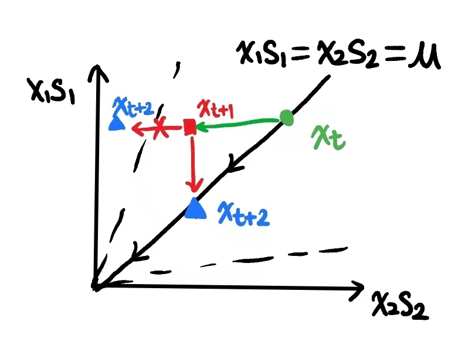

## Introduction to LP Problems

#### Polyhedron and convex sets

We might as well revisit some definitions in convex optimization.

>**Definition 1.1 (Convexity and Concavity)**
>(a) A function $f: \Re^{n} \mapsto \Re$ is called convex if for every $\mathbf{x}, \mathbf{y} \in \Re^{n}$, and every $\lambda \in[0,1]$, we have
>$$
>f(\lambda \mathbf{x}+(1-\lambda) \mathbf{y}) \leq \lambda f(\mathbf{x})+(1-\lambda) f(\mathbf{y})
>$$
>(b) A function $f: \Re^{n} \mapsto \Re$ is called concave if for every $\mathbf{x}, \mathbf{y} \in \Re^{n}$, and every $\lambda \in[0,1]$, we have
>$$
>f(\lambda \mathbf{x}+(1-\lambda) \mathbf{y}) \geq \lambda f(\mathbf{x})+(1-\lambda) f(\mathbf{y})
>$$

We also start with the formal definition of a polyhedron.

>**Definition 1.2 (Polyhedron)** A polyhedron is a set that can be described in the form $\left\{\mathbf{x} \in \Re^{n} \mid \mathbf{A} \mathbf{x} \geq \mathbf{b}\right\}$, where $\mathbf{A}$ is an $m \times n$ matrix and $\mathbf{b}$ is a vector in $\Re^{m}$.

## Interior Point Method

#### Intro

There are three types of Interior Point Methods.

- Affine Scaling Algorithm
- Potential Reduction
- Path Following ✌
  - Primal -> Barrier Method
  - Primal-Dual -> KKT System

In this chapter, we will consider the linear programming problem in standard form.
$$
\begin{align*}

\min\, &c^Tx\\
\textrm{s.t}\, &Ax=b\\
&x>0

\end{align*}
$$

>**Definition 4.1** Given polyhedron $P=\{x|Ax=b, x\ge 0\}$, the interior point of $P$ is defined as $\{x\in P|x>0\}$. 

#### Primal Method

If we only consider the primal problem, we could integrates inequality constraints to the objective function using a logarithmic barrier $\phi(x) = \sum_{i=1}^n log(x_i)$.

>**Definition 4.2 (Barrier Method)**  To solve the LP problem in standard form, we introduce a variable $\mu > 0$, and the problem can be reformulated as $(P_\mu)$,
>$$
>\begin{align*}
>	\min &\quad c^Tx-\mu\sum^n_{i=1}log(x_i)\\
>	\textrm{s.t}&\quad Ax=b
>\end{align*}
>$$
>$\forall \mu > 0$, $\exist$ unique $x(\mu)$ that solves $(P_\mu)$. When $\mu\downarrow0$, $\lim_{\mu\rightarrow0}x(\mu) = x^*$.

#### Primal-Dual Method

##### Intro

If we consider both the primal and dual problem, we could solve the KKT condition of the LP problem. Let us start with the KKT condition of the standard form.
$$
\left\{\begin{array}{l}
A x=b \\
A^{\top} y+s=c \\
x_{i} s_{i}=0 \quad i=1, \cdots, 2, n \\
(x, s)>0
\end{array}\right.
$$
Define the non-linear system,
$$
F(x, y, s)=
\begin{pmatrix}
Ax-b\\
A^T+s-c\\
x\circ s
\end{pmatrix} = 0
$$
Intuitively, we will use Newton method to solve non-linear systems. But here, we will first define a feasible set $\mathcal{F}=\{(x, y, s)|Ax=b, A^Ty+s=c, (x, s)>0\}$, and a central path $(x(\mu), y(\mu), s(\mu))\in \mathcal{F}$, which converges to $F(x, y, s)=0$. The central path is given by,
$$
F(x(\mu), y(\mu), s(\mu))=
\begin{pmatrix}Ax-b\\
A^T+s-c\\
x\circ s - \mu
\end{pmatrix} 
= 0
$$
>**Definition 4.3 (Primal-Dual Method)** Given the above central path. $\forall \mu > 0$, $\exist$ unique $$(x(\mu), y(\mu), s(\mu))\in \mathcal{F}$$ that solves $F(x(\mu), y(\mu), s(\mu))=0$. When $\mu\downarrow0$, $\lim_{\mu\rightarrow0}(x(\mu), y(\mu), s(\mu)) = (x^*, y^*, s^*)$.

>**Lemma 9.5 (of Bertsimas)** If $x^*=x(\mu)$, $y^*=y(\mu)$ and $s^*=s(\mu)$ satisfy condition $F(x(\mu), y(\mu), s(\mu))=0$, then they are also optimal solution to $\min \, c^Tx-\mu\sum^n_{i=1}log(x_i) \quad \textrm{s.t}\, Ax=b$.
>
>**Proof:** Let $x$ be an arbitrary vector that satisfies $x\ge0$ and $Ax=b$. The barrier function will be,
>$$
>\begin{align*}
>B_\mu(x) &= c^Tx-\mu\sum^n_{i=1}log(x_i)\\
>	     &= c^Tx+y^{*T}(b-Ax)-\mu\sum^n_{i=1}log(x_i)\\
>	     &= (c-A^Ty^*)^Tx+y^{*T}b-\mu\sum^n_{i=1}log(x_i)\\
>	     &= s^{*T}x+y^{*T}b-\mu\sum^n_{i=1}log(x_i)\\
>\end{align*}
>$$
>Take out $s^{*T}x-\mu\sum^n_{i=1}log(x_i)$, and set the derivative to zero, we have,
>$$
>s_i^*-\mu x_i=0
>$$
>Replacing $x_i = \dfrac{s_i^*}{\mu}$, we will have,
>$$
>B_\mu(x)\ge n\mu+y^{*T}b-\mu\sum^n_{i=1}log(\dfrac{s_i^*}{\mu})
>$$
>This means $x^*=\dfrac{s^*}{\mu}$ is the optimal solution to the barrier function, $B_\mu(x^*)\le B_\mu(x)$. 

You may also derive the KKT condition for log-barrier method $(P_\mu)$, which is equivalent to the KKT condition in central path.

##### Recap: Newton's Method

Recall that we can solve a non-linear system with Newton-Raphson method.
$$
f(x_k+d_k) \approx f(x_k) + f'(x_k) d_k = 0\\
x_{k+1} \leftarrow x_k+d_k = x_k - \dfrac{f(x_k)}{f'(x_k)}
$$
And for multivariable cases,
$$
F(x_k+d_k) \approx F(x_k) + Jf(x_k)d_k=0\\
x_{k+1}\leftarrow x_k+d_k=x_k-[JF(x_k)]^{-1}F(x_k)
$$
When using Newton-Raphson method, we must follow

- $JF(x_k)$ must be non-singular
- $\textrm{step-length}=1$
- Fast local convergence (super linear), but no global convergence guaranteed

>**Theorem 4.1 (Convergence of Newton Method)** Newton method has super linear convergence, i.e $\|x_{k+1}-x_*\|_2\le M\|x_k-x_*\|^2_2$.
>
>**Proof** We first define $g(x) = x-\dfrac{f(x)}{f'(x)}$. It is clear that $g'(x) = \dfrac{f(x)f''(x)}{[f'(x)]^2}$ and $g'(x_*)=0$. Then, we can find that,
>$$
>\begin{align*}
>\|x_{k+1}-x_*\| &= \|x_k-\dfrac{f(x_k)}{f'(x_k)} - x_*\|\\
>				&= \|(x_k-\dfrac{f(x_k)}{f'(x_k)}) - (x_*-\dfrac{f(x_*)}{f'(x_*)})\|\\
>				&= \|g(x_k)-g(x_*)\|\\
>				&= \|g'(\xi)(x_k-x_*)\|\\
>				&= |g'(\xi)-g'(x_*)|\cdot\|x_k-x_*\|\\
>				&\le |g''(\eta)|\cdot\|x_k-x_*\|^2\\
>				&\le M\cdot\|x_k-x_*\|^2
>				
>				
>\end{align*}
>$$
> This method is local quadratically convergent to a solution. 

We can derive one Newton step as follows.
$$
\begin{pmatrix}
x_{k+1}\\
y_{k+1}\\
s_{k+1}
\end{pmatrix}\leftarrow
\begin{pmatrix}
x_{k}\\
y_{k}\\
s_{k}
\end{pmatrix} - 
\begin{pmatrix}
\Delta x_{k}\\
\Delta y_{k}\\
\Delta s_{k}
\end{pmatrix}
$$
where
$$
\begin{pmatrix}
\Delta x_{k}\\
\Delta y_{k}\\
\Delta s_{k}
\end{pmatrix} = [JF(x^k, y^k, s^k)]^{-1} F(x^k, y^k, s^k)
$$
is the solution to the following linear equations.
$$
\begin{pmatrix}
0 & A^T & I\\
A & 0 & 0\\
S & 0 & X
\end{pmatrix}
\begin{pmatrix}
\Delta x_{k}\\
\Delta y_{k}\\
\Delta s_{k}
\end{pmatrix}
=\begin{pmatrix}
A^Ty+s-c\\
Ax-b\\
s\circ x
\end{pmatrix}
$$

##### Practical Newton Method in IPM

Note that the Newton method doesn't guarantee global convergence, we need to avoid a single $s_ix_i<0$. Otherwise, $(x_k, y_k, s_k)$ will fall out of the feasible set $\mathcal{F}=\{(x, y, s)|Ax=b, A^Ty+s=c, x, s>0\}$.

Therefore, we will introduce an intermediate variable $\mu$ to keep both optimality and centrality, and solve $s\circ x=\mu$ instead of $s\circ x=0$.

>#### Primal-Dual IPM-Naive:
>
>Initial state:
>$$
>\left(x^{0}, y^{0}, s^{0}\right) \in F_{0} \quad \tau=\sigma \mu \quad \sigma \in(0,1) \quad \mu=\frac{1}{n} x^{\top} s
>$$
>For $k=0,1, \cdots$
>
>​		Use Newton's Method with starting point $\left(x^{k}, y^{k}, s^{k}\right)$ to solve $F(x, y, s)=\left(\begin{array}{c}0 \\ 0 \\ \sigma \mu_{k} e\end{array}\right)$ and get,
>$$
>\left(x^{k+1}, y^{k+1}, s^{k+1}\right) \in F^{0}
>$$
>end

However, there is no necessity to compute the full Newton iteration. We can compute one Newton step and change the direction.

>#### Primal-Dual IPM-Practical
>(Only one iteration for inner Newton step.)
>
>Initial state:
>$$
>\left(x^{0}, y^{0}, s^{0}\right),\left(x^{0}, s^{0}\right)>0
>$$
>For $k=0,1,2, \cdots$
>
>​		Choose $\sigma_{k} \in[0,1]$, $\mu_{k}=\dfrac{1}{n} x^T s$
>
>​		Find the Newton step of
>$$
>\widetilde{F}_{k}(x, y, s)=\begin{pmatrix}
>A^{\top} y+s-c \\
>A x-b \\
>x \circ s-\sigma_k \cdot \mu_{k} \cdot e
>\end{pmatrix}=0
>$$
>​		with the linear equations,
>$$
>\begin{pmatrix}
>0 & A^{\top} & I \\
>A & 0 & 0 \\
>S^{k} & 0 & X^{k}
>\end{pmatrix}
>\begin{pmatrix}
>\Delta x^{k} \\
>\Delta y^{k} \\
>\Delta s^{k}
>\end{pmatrix}=\begin{pmatrix}
>A^{\top} y+s-c \\
>A x-b \\
>x \circ s -\sigma_k \cdot \mu_{k} \cdot e
>\end{pmatrix}
>$$
>​		Find step-size $\alpha_k$, subject to $(x_{k+1}, s_{k+1})>0$
>$$
>\left(x_{k+1}, y_{k+1}, s_{k+1}\right)\leftarrow\left(x_{k}, y_{k}, s_{k}\right)+\alpha_{k}\left(\Delta x_{k}, \Delta y_{k}, \Delta s_{k}\right)
>$$
>
>End

The following graph shows the path of convergence. If $\sigma=1$, $\tau=\mu$, the central path converges to $\mu$. If $\sigma=0$, $\tau=0$, the central path may not converge. We will discuss how to find $\sigma_k$ and $\alpha_k$ in the following section.

##### Path-Following Methods

For the sake of simplicity, we will define two types of neighborhoods.
$$
\mathcal{N}_2(\theta)=\{(x, y, s)\in\mathcal{F}|\|x\circ s-\mu e\|\le\theta \mu\}\\
\mathcal{N}_{-\infty}(\gamma)=\{(x, y, s)\in\mathcal{F}|x_is_i\ge\gamma\mu, i=1,2,\cdots,n\}\\
$$
We have different path-following routines. These routines will guarantee us the convergence.

- Long-step Path-Following $\rightarrow$ $\mathcal{N}_{-\infty}$
- Short-step Path-Following $\rightarrow$ $\mathcal{N}_{2}$

>#### Long-Step Path-Following IPM
>
>Initial State:
>
>​		Given $\gamma\in(0, 1)$, $0<\sigma_{min}\le\sigma_{max}<1$, $(x^0, y^0, s^0) \in \mathcal{N}_{-\infty}(\gamma)$
>
>For $k=0, 1, \cdots$
>
>​		Choose $\sigma_k\in[\sigma_{min}, \sigma_{max}]$, $\mu_{k}=\dfrac{1}{n} x^T s$
>$$
>\begin{pmatrix}
>0 & A^{\top} & I \\
>A & 0 & 0 \\
>S^{k} & 0 & X^{k}
>\end{pmatrix}
>\begin{pmatrix}
>\Delta x^{k} \\
>\Delta y^{k} \\
>\Delta s^{k}
>\end{pmatrix}=\begin{pmatrix}
>A^{\top} y+s-c \\
>A x-b \\
>x \circ s -\sigma_k \cdot \mu_{k} \cdot e
>\end{pmatrix}
>$$
>​		Choose $\alpha_k$ as the largest value of $\alpha$ such that $(x^k(\alpha), y^k(\alpha), s^k(\alpha))\in \mathcal{N}_{-\infty}(\gamma)$, i.e.
>$$
>x^k(\alpha) := x^k+\alpha\Delta x^k\\
>y^k(\alpha) := y^k+\alpha\Delta y^k\\
>s^k(\alpha) := s^k+\alpha\Delta s^k\\
>$$
>​		We have $\mu^k(\alpha)=\dfrac{1}{n}x^k(\alpha)^Ts^k(\alpha)$, and $x_i^k(\alpha) s_i^k(\alpha)\ge\gamma\mu^k(\alpha)$.
>
>​		Set $(x^{k+1}, y^{k+1}, s^{k+1}) = (x^k, y^k, s^k) + \alpha_k (\Delta x^k, \Delta y^k, \Delta s^k)$

However, there are several concerns about this method.

- Can we find positive $\alpha_k$?
- Can we reduce $\mu^k$?

Both answers are YES. We will go through Lemma 4.1 and Theorem 4.2 to prove this.

>**Lemma 4.1 (Lemma 14.2 in Numerical Optimization)** If $(x, y, s) \in \mathcal{N}_{-\infty}(\gamma)$, then, $\|\Delta X\Delta S e\|\le2^{-3/2}(1+\dfrac{1}{\gamma})n\mu$.
>
>**Proof**
>
>Note that
>$$
>\|UVe\|\le2^{-3/2}\|u+v\|^2_2
>$$
>Define $D=X^{1/2} S^{-1/2}$. We can also derive $D^{-1}\Delta x+D\Delta s=(XS)^{-1/2}(-XSe+\sigma \mu e)$.
>$$
>\begin{align*}
>\|\Delta X \Delta S e\| &= \|(D^{-1}\Delta X)(D\Delta S)e\|\\
>						&\le 2^{-3/2}\|D^{-1}\Delta x+D\Delta s\|^2\\
>						&= 2^{-3/2}\|(XS)^{-1/2}(-XSe+\sigma \mu e)\|^2\\
>						&= 2^{-3/2}(\left<e, XSe\right>-2\sigma\mu e^Te+\sigma^2\mu^2\sum^n_{i=1}\dfrac{1}{x_is_i})\\
>						&\le 2^{-3/2}(x^Ts-2n\sigma\mu+\sigma^2\mu^2\dfrac{n}{\gamma\mu})\\
>						&=2^{-3/2}\left[1-2\sigma+\dfrac{\sigma^2}{\gamma}\right]n\mu\\
>						&\le 2^{-3/2}(1+1/\gamma)n\mu
>\end{align*}
>$$
>We can also derive that $\Delta x_i^k\Delta s_i^k\ge-|\Delta x_i^k\Delta s_i^k|\ge-\|\Delta X^k\Delta S^ke\|_2\ge-2^{-3/2}(1+1/\gamma)n\mu$. 

>**Theorem 4.2 (Theorem 14.3 in Numerical Optimization)** Given $\gamma$, $\sigma_{min}$, $\sigma_{max}$ in algorithm, $\exist \delta>0$ independent of $n$, such that
>$$
>\mu_{k+1}\le (1-\dfrac{\delta}{n})\mu_k
>$$
>**Proof** 
>
>We will first prove that $(x^k(\alpha), y^k(\alpha), s^k(\alpha)) \in \mathcal{N}_{-\infty}(\gamma)$, $\forall \alpha \in\left[0, 2^{3/2}\gamma\dfrac{1-\gamma}{1+\gamma}\dfrac{\sigma_k}{n}\right]$.
>
>This is equivalent to proving $\forall \alpha \in\left[0, 2^{3/2}\gamma\dfrac{1-\gamma}{1+\gamma}\dfrac{\sigma_k}{n}\right]$
>$$
>s_i^k(\alpha)x_i^k(\alpha)\ge\gamma\dfrac{x^k(\alpha)^Ts^k_i(\alpha)}{n}
>$$
>From the Newton step equations we can derive $s_i^k\Delta x_i^k+x_i^k\Delta s_i^k=-x_i^ks_i^k+\sigma \mu_k$. And since $\Delta x_i^k\Delta s_i^k\ge-2^{-3/2}(1+1/\gamma)n\mu$.
>$$
>\begin{align*}
>x_i^k(\alpha)s_i^k(\alpha)&=(x_i^k+\alpha\Delta x_i^k)(s_i^k+\alpha\Delta s_i^k)\\
>		&=x_i^ks_i^k+\alpha(s_i^k\Delta x_i^k+x_i^k\Delta s_i^k)+\alpha^2\Delta x_i^k\Delta s_i^k\\
>		&=(1-\alpha)x_i^ks_i^k+\alpha\sigma_k\mu_k+\alpha^2\Delta x_i^k\Delta s_i^k\\
>		&\ge \gamma(1-\alpha)\mu_k+\alpha\sigma_k\mu_k-\alpha^22^{-3/2}(1+1/\gamma)n\mu_k
>\end{align*}
>$$
>We also have $\Delta x^T \Delta s=0$, and
>$$
>\begin{align*}
>	\mu_k(\alpha)&=\dfrac{(x+\alpha \Delta x)^T(s+\alpha \Delta s)}{n}\\
>				 &=\mu_k-\alpha(\mu_k-\sigma\mu_k)\\
>				 &=(1-\alpha+\alpha\sigma)\mu_k
>\end{align*}
>$$
>To satisfy $x_i^k(\alpha)s_i^k(\alpha)\ge\gamma\mu_k(\alpha)$, we have to let
>$$
>\gamma(1-\alpha)\mu_k+\alpha\sigma_k\mu_k-\alpha^22^{-3/2}(1+1/\gamma)n\mu_k\ge \gamma(1-\alpha+\alpha\sigma)\mu_k
>$$
>Rearranging this expression, we obtain
>$$
>	\alpha\sigma_k\mu_k(1-\gamma)\ge\alpha^22^{-3/2}n\mu_k(1+1/\gamma)
>$$
>which is
>$$
>\alpha\le\dfrac{2^{3/2}}{n}\sigma_k\gamma\dfrac{1-\gamma}{1+\gamma}
>$$
>We choose $\alpha\in\left(0, \dfrac{2^{3/2}}{n}\sigma_k\gamma\dfrac{1-\gamma}{1+\gamma}\right]$
>$$
>\begin{align*}
>\mu_{k+1} &= (1-\alpha_k(1-\sigma_k))\mu_k\\
>		  &\le (1-\dfrac{2^{3/2}}{n}\sigma_k(1-\sigma_k)\gamma\dfrac{1-\gamma}{1+\gamma})\mu_k
>\end{align*}
>$$
>If $\delta=\max_{\sigma_k}\left\{2^{3/2}\sigma_k(1-\sigma_k)\gamma\dfrac{1-\gamma}{1+\gamma}\right\}$, we will prove that $\mu_{k+1}\le(1-\dfrac{\delta}{n})\mu_k$.#
>
>This means we only need $O(n\log1/\epsilon)$ steps to reduce $\mu_k$ to $\epsilon\cdot\mu_0$.

##### Mehrotra Algorithm (1990s)
