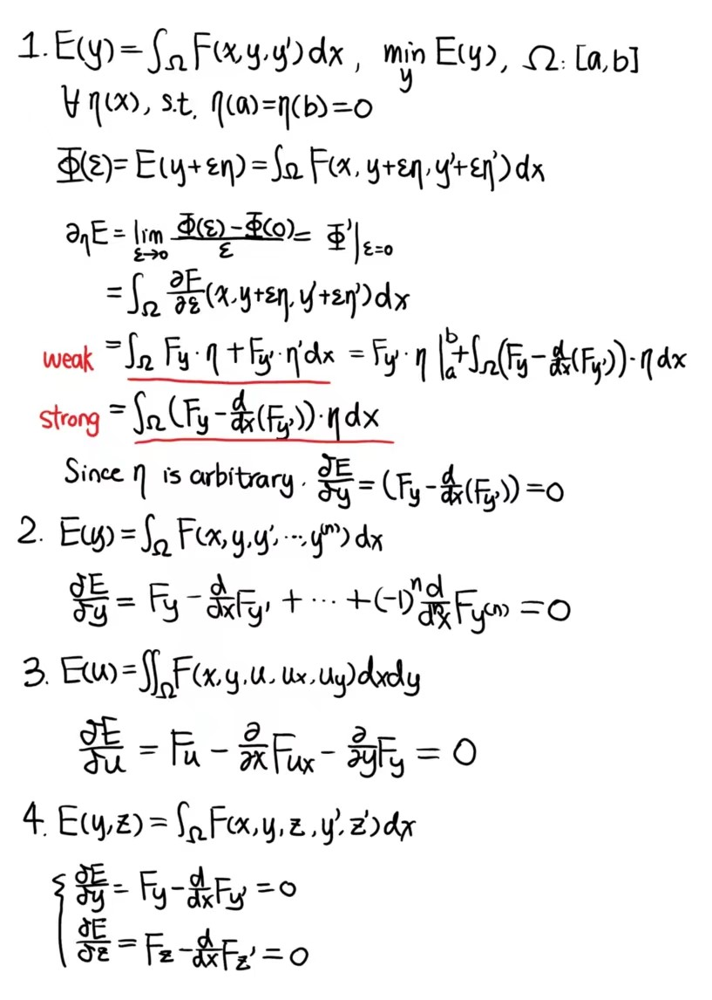
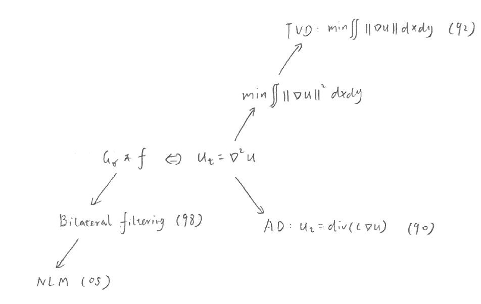
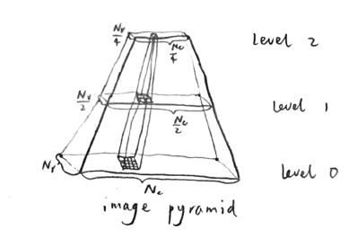

## Reconstruction

### Fourier transform

- 1D FT: $\hat{f}(w)=\mathcal{F}(f)=\int_{-\infty}^{\infty} f(x) e^{-j 2 \pi \omega x} d x$
- 1D IFT: $f(x)=\mathcal{F}^{-1}(\hat{f})=\int_{-\infty}^{\infty} \hat{f}(\omega) e^{j 2 \pi \omega x} d \omega$
- 2D FT: $\hat{f}(u, v)=\mathcal{F}(f)=\iint_{-\infty}^{\infty} f(x, y) e^{-j 2 \pi(u x+v y)} d x d y$
- 2D IFT: $f(x, y)=\mathcal{F}^{-1}(\hat{f})=\iint_{-\infty}^{\infty} \hat{f}(u, v) e^{j 2 \pi(u x+v y)} d u d v$

Properties:

- Linearity
  $$
  \mathcal{F}\{a f(x, y)+b g(x, y)\}=a \mathcal{F}(f)+b \mathcal{F}(g)
  $$

- Scaling

$$
\mathcal{F}\{f(a x, b y)\}=\frac{1}{|a b|} \hat{f}\left(\frac{u}{a}, \frac{v}{b}\right)
$$

- Shifting / Translation

$$
\mathcal{F}\{f(x-a, y-b)\}=e^{-j 2 \pi(a u+b v)} \hat{f}(u, v)
$$

- Differentiation

$$
\begin{aligned}
\mathcal{F}\left(\frac{\partial}{\partial x} f\right) &=j 2 \pi u \hat{f}(u, v) \\
\mathcal{F}\left(\frac{\partial}{\partial y} f\right) &=j 2 \pi v \hat{f}(u, v) \\
\mathcal{F}\left(\frac{\partial^{2}}{\partial x \partial y} f\right) &=-4 \pi^{2} u v \hat{f}(u, v) \\
\mathcal{F}\left(\nabla^{2} f\right) &=-4 \pi^{2}\left(u^{2}+v^{2}\right) \hat{f}(u, v)
\end{aligned}
$$

- Rotation

$$
\mathcal{F}(f(x \cos \theta-y \sin \theta, x \sin \theta+y \cos \theta))
=\hat{f}(u \sin \theta-v \sin \theta, u \sin \theta+v \cos \theta)
$$

### Convolution

- Commutativity

$$
f * g=g * f
$$
- Associativity

$$
f *(g * h)=(f * g) * h
$$
- Distributivity

$$
f *(g+h)=f * g+f * h
$$
- Differentiation $(\partial \eta$ is directional derivative along $\eta$ )

$$
\partial_{\eta}(f * g)=\partial_{\eta} f * g=f * \partial_{\eta} g
$$

Convolution Theorem
$$
\mathcal{F}\{f*g\}(\xi)=\hat{f}(\xi)\hat{g}(\xi)
$$

### FT examples

2D Gaussian
$$
G_{\sigma}(x, y) \stackrel{\mathcal{F}}{\longleftrightarrow} e^{-2 \pi^{2} \sigma^{2}\left(u^{2}+v^{2}\right)}
$$
Delta function
$$
\delta(u-a, v-b) \stackrel{\mathcal{F}}{\longleftrightarrow} e^{j2 \pi\left(xa+yb\right)}
$$
Rectangular function
$$
\operatorname{rect}(x, y)= \begin{cases}1, & (x, y) \in\left[-\frac{1}{2}, \frac{1}{2}\right] \times\left[-\frac{1}{2}, \frac{1}{2}\right] \\ 0, & \text { otherwise }\end{cases}
$$
$$
\operatorname{rect}(x, y) \stackrel{\mathcal{F}}{\longleftrightarrow} \operatorname{sinc}(\pi u) \operatorname{sinc}(\pi v)\\
\operatorname{sinc}(x)=\frac{\sin (x)}{x}
$$
Comb function
$$
\mathrm{\Pi I}_{\Delta x, \Delta y}(x, y)=\sum_{m=-\infty}^{\infty} \sum_{n=-\infty}^{\infty} \delta(x-m \Delta x, y-n \Delta y)
$$
$$
\mathrm{\Pi I}_{\Delta x, \Delta y}(x, y) \stackrel{\mathcal{F}}{\longleftrightarrow} \frac{1}{\Delta x \Delta y} \mathrm{\Pi I}_{\frac{1}{\Delta x} \frac{1}{\Delta y}}(u, v)
$$

## Enhancement

### Filtering

Additive model
$$
\underbrace{f(x, y)}_{\text {observed image }}=\underbrace{u(x, y)}_{\text {unstained image }}+\underbrace{n(x, y)}_{\text {noise }}, \quad(x, y) \in \Omega
$$
Method noise ($\mathcal{D}$ is the denoising operator)
$$
f(x, y)-\mathcal{D}\{f\}(x, y)
$$
Ideal denoising operator $\mathcal{D}$ should have
$$
f(x, y)-\mathcal{D}\{f\}(x, y)\sim\mathcal{N}(\cdot|\mu, \sigma)
$$
An isotropic Gaussian filter
$$
\begin{aligned}
&G_{\sigma}(x, y)=\frac{1}{2 \pi \sigma^{2}} e^{-\frac{x^{2}+y^{2}}{2 \sigma^{2}}} \\
&u(x, y)=G_{\sigma}(x, y) * f(x, y)
\end{aligned}
$$
Implementation (suppress the high frequency information)
$$
u(x, y)=\mathcal{F}^{-1}\left\{e^{-2 \pi^{2} \sigma^{2}\left(\xi_{1}^{2}+\xi_{2}^{2}\right)} \hat{f}\left(\xi_{1}, \xi_{2}\right)\right\}
$$

### Scale Space

#### Heat Equation

Green's Theorem
$$
\underbrace{\oint_{\partial\Omega} \vec{F} \cdot \vec{n} d s}_{\substack{\text { Outward } \\ \text { Flux }}}=\iint_{\Omega}\underbrace{\left(\frac{\partial M}{\partial x}+\frac{\partial N}{\partial y}\right)}_{\text {Divergence }} d x d y
$$
Heat flow is a vector field

$$
V(x, y, t)=-c(x, y) \nabla u(x, y, t)
$$
where $\nabla=\left(\frac{\partial}{\partial x}, \frac{\partial}{\partial y}\right), c(x, y)$ is the thermal conductivity.

Temperature change over $\Omega_p$
$$
-\oint_{\partial \Omega_{p}} V(x, y, t) \cdot n d s=-\iint_{\Omega_{p}} \operatorname{div}(V(x, y, t)) d x d y
$$
Taking the limit of $\left|\Omega_{p}\right| \rightarrow 0$, the rate of change becomes
$$
\frac{\partial u(x, y, t)}{\partial t} = \operatorname{div}(c(x, y) \nabla u(x, y, t))
$$

#### Isotropic Diffusion

Solve $u(x, y, t)$ from a PDE
$$
\begin{aligned}
&\frac{\partial u}{\partial t}=\frac{\partial^{2} u}{\partial x^{2}}+\frac{\partial^{2} u}{\partial y^{2}} \\
&u(x, y, 0)=f(x, y)
\end{aligned}
$$
Frequence domain
$$
\begin{gathered}
u(x, y, t) \stackrel{\mathcal{F}}{\rightarrow} \hat{u}\left(\xi_{1}, \xi_{2}, t\right)\\
\frac{\partial}{\partial t} \hat{u}\left(\xi_{1}, \xi_{2}, t\right)=-4 \pi^{2}\left(\xi_{1}^{2}+\xi_{2}^{2}\right) \hat{u}\left(\xi_{1}, \xi_{2}, t\right) \quad \text { (differentiation property) } \\
\hat{u}\left(\xi_{1}, \xi_{2}, 0\right)=\hat{f}\left(\xi_{1}, \xi_{2}\right) .
\end{gathered}
$$
Solution
$$
\hat{u}\left(\xi_{1}, \xi_{2}, t\right)=\hat{u}\left(\xi_{1}, \xi_{2}, 0\right) e^{-4 \pi^{2}\left(\xi_{1}^{2}+\xi_{1}^{2}\right) t}
$$
Equivalent to Gaussian smoothing
$$
\begin{gather}
g_{\tau}(x, y)=\frac{1}{4 \pi \tau} e^{-\frac{x^{2}+y^{2}}{4 \tau}}, \quad \tau=\frac{\sigma^{2}}{2} \\
u(x, y, \tau)=g_{\tau}(x, y) * f(x, y) \\
u(x, y, 0)=f(x, y)
\end{gather}
$$

#### Anisotropic Diffusion

$$
\begin{aligned}
u_{t} &=\operatorname{div}(c(x, y, t) \nabla u) \\
&=c_{x} u_{x}+c u_{x x}+c_{y} u_{y}+c u_{y y} \\
&=\nabla c \cdot \nabla u+c \nabla^{2} u
\end{aligned}
$$
Choice of $c(x, y, t)$
$$
\begin{aligned}
c(x, y, t) &=e^{-(\|\nabla u\| / k)^{2}} \\
\text { or } c(x, y, t) &=\frac{1}{1+\left(\frac{\|\nabla u\|}{k}\right)^{2}} .
\end{aligned}
$$

#### Method noise

Taylor expansion trick
$$
\begin{aligned}
u(x, y, \tau) &=u(x, y, 0)+\tau u_{t}(x, y, 0)+O\left(\tau^{2}\right)
\end{aligned}
$$
Hence,
$$
f-\mathcal{D}\{f\}=-\tau u_{t}(x, y, 0)+O\left(\tau^{2}\right)
$$
For different methods
$$
f-\mathcal{GF}\{f\}=-\tau \nabla^2f+O\left(\tau^{2}\right)\\
f-\mathcal{AD}\{f\}=-\tau \operatorname{div}\left(c(x, y, 0)\nabla f\right)+O\left(\tau^{2}\right)
$$

### Calculus of variations

### Total Variance Denoising

Energy function
$$
\min _{u} \iint_{\Omega} \underbrace{\|\nabla u\|}_{\text {total variation }}+\frac{\lambda}{2}(f-u)^{2} d x d y .
$$
E-L equation
$$
\begin{aligned}
\frac{\delta E}{\delta u} &=\lambda(u-f)-\frac{\partial}{\partial x}\left(\frac{u_{x}}{\sqrt{u_{x}^{2}+u_{y}^{2}}}\right)-\frac{\partial}{\partial y}\left(\frac{u_{y}}{\sqrt{u_{x}^{2}+u_{y}^{2}}}\right) \\
&=\lambda(u-f)-\operatorname{div}\left(\frac{\nabla u}{\|\nabla u\|}\right)
\end{aligned}
$$
Method noise
$$
f-T V D\{f\}=-\frac{1}{\lambda} \operatorname{curv}(T V D\{f\})
$$

### Solve PDE

<a href="ref/常微分方程.pdf">Lecture notes (previous course)</a>

### Roadmap

## Registration

General Formulation
$$
E(\phi) = d(I, J\circ\phi) + \lambda L(\phi)
$$

### Similarity metrics

1. Sum of square distance

$$
d(I, J) = \sum_{x\in\Omega}\left(I(x) - J(x)\right)^2
$$

2. Cross correlation

   Cross correlation quantifies the linear relationship

$$
\begin{aligned}
&c c(I, J)=\frac{\mathbb{E}\left[\left(i-\mu_{i}\right)\left(j-\mu_{j}\right)\right]}{\mathbb{E}\left[\left(i-\mu_{i}\right)^{2}\right]^{\frac{1}{2}} \mathbb{E}\left[\left(j-\mu_{j}\right)^{2}\right]^{\frac{1}{2}}} \propto \frac{\left\langle I-\mu_{I}, J-\mu_{J}\right\rangle}{\sigma_{I} \sigma_{J}}\\
&\text { where }\left\{\begin{array}{l}
i=I(x), x \sim u\left(\Omega_{d}\right) \\
j=J(x), x \sim u\left(\Omega_{d}\right)
\end{array}\right.
\end{aligned}
$$

3. Mutual information

$$
\begin{aligned}
\operatorname{MI}(I ; J) &=\mathrm{KL}(P(i, j) \| P(i) P(j)) \\
&=\sum_{i} \sum_{j} P(i, j) \log \frac{P(i, j)}{P(i) P(j)}\\
&=\sum_i\sum_j P(i, j)\log P(i, j) - \sum_i P(i)\log P(i) - \sum_j P(j)\log P(j)\\
&=-H(I, J)+H(I)+H(J)
\end{aligned}
$$

### Multi-resolution search

### Phase correlation

$$
\begin{aligned}
&\text { Input: I, J }\\
&\qquad\hat{I}(u, v)=\mathcal{F}(I(x, y)) \\
&\qquad\hat{J}(u, v)=\mathcal{F}(J(x, y)) \\
&\qquad R(u, v)=\frac{\hat{I}(u, v) \hat{J}^{*}(u, v)}{\left|\hat{I}(u, v) \hat{J}^{*}(u, v)\right|} \\
&\qquad r(x, y)=\mathcal{F}^{-1}(R(u, v)) \\
&\qquad \left(\tau_{x}, \tau_{y}\right)=\arg \max _{(x, y) \in \Omega} r(x, y) \\
&\text { Output } t_{x}, t_{y}
\end{aligned}
$$

### Diffusion model

$$
E(u)=\int_{\Omega}\left[I(x)-J(\phi(x))]^{2}+\lambda\left(\left\|\nabla u_{1}\right\|^{2}+\left\|\nabla u_{2}\right\|^{2}\right) d x\right.
$$

### Demon

Optic flow $v(x) = \left(v_1(x), v_2(x)\right)$
$$
\begin{align*}
I\left(x_{1}, x_{2}, t\right)&=I\left(x_{1}+v_{1} \Delta t, x_{2}+v_{2} \Delta t, t+\Delta t\right), \quad\left(x_{1}, x_{2}\right) \in \Omega\\
&=I\left(x_{1}, x_{2}, t\right)+v_{1} \Delta t \frac{\partial I}{\partial x_{1}}\left(x_{1}, x_{2}, t\right)+v_{2} \Delta t \frac{\partial I}{\partial x_{2}}\left(x_{1}, x_{2}, t\right)+\Delta t \frac{\partial I}{\partial t}\left(x_{1}, x_{2}, t\right)+O\left(\Delta t^{2}\right)
\end{align*}
$$
or
$$
v\cdot\nabla I = -I_t
$$
Apply to registration
$$
\begin{align*}
I\left(x_{1}, x_{2}\right)&=I\left(x_{1}, x_{2}, 0\right),\\
J\left(x_{1}, 
x_{2}\right)&=I\left(x_{1}, x_{2}, \Delta t\right),\\
\phi\left(x_{1}, 
x_{2}\right)&=\left(x_{1}+v_{1} \Delta t, x_{2}+v_{2} \Delta t\right)\\
(J \circ \phi)\left(x_{1}, x_{2}\right)&=J\left(x_{1}+v_{1} \Delta t, x_{2}+v_{2} \Delta t\right)\\&=I\left(x_{1}+v_{1} \Delta t, x_{2}+v_{2} \Delta t, \Delta t\right)\\&=I\left(x_{1}, x_{2}, 0\right)=I\left(x_{1}, x_{2}\right)
\end{align*}
$$
And
$$
u(x) = v(x) \cdot \Delta t\\
u\cdot\nabla I=I-J
$$
Solve $u(x)=\frac{I(x)-J(x)}{\|\nabla I\|^{2}} \nabla I(x)$ or practically
$$
u(x)=\left\{\begin{array}{c}
0, \text { if }\|\nabla I\|^{2}+(I-J)^{2}<\epsilon \\
\frac{I-J}{\|\nabla\|^{2}+(I-J)^{2}} \nabla I, \text { otherwise }
\end{array}\right.
$$
Update $\phi: \phi \leftarrow \phi \circ\left(I_{d}+u\right)$

### LDDMM

Too difficult
