#### Data Parallelism v.s. Model Parallelism

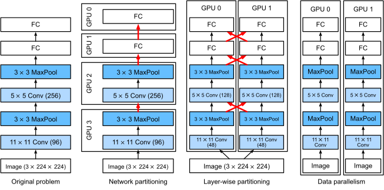

For forward pass in data parallelism, the host (CPU/GPU#0) split the batch into micro-batches and scatter them to all devices (GPU#0, GPU#1, ..., GPU#p-1). After that, a backward pass is conducted to compute the gradients for each micro-batch. The gradients are then gathered to the host, i.e $g = \frac{1}{p}\sum g_i$, and update the weights for the network.

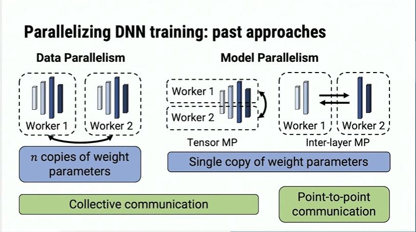

Model parallelism is far more complicated. There could be inter-layer parallelism (tensor parallelism), intra-layer parallelism (such as what Megatron-LM do in its multi-head self-attention layers) and pipeline parallelism(such as GPipe), as far as I know. Inter-layer parallelism needs more communications while inter-layer parallelism has less worries about that.

Data parallelism has its drawbacks. When the batch size is too large, say micro-batches split on 1024 GPUs, the training loss fails to converge quick enough. We need more epochs to finish our tasks. Thus, it is not wise to pile up GPUs to train.

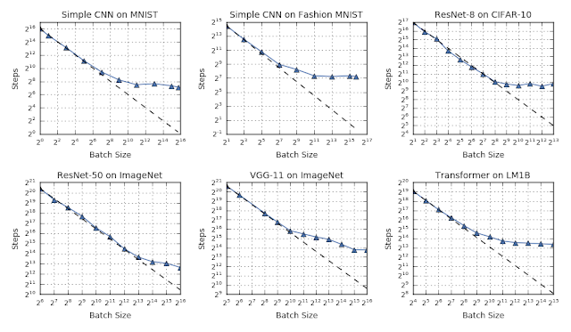

Also, when modern networks contain trillions of parameters, it is impossible to store the whole model inside a single GPU. So model parallelism is inevitable. For example, the DeepSpeed ZeRO-3 has made large scale training possible.

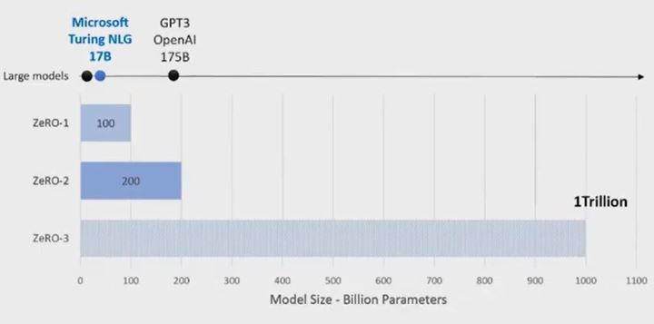

#### Pipeline Parallelism

Pipeline parallelism is a smart method to realize the inter-layer parallelism. I think it is less related to parallel computing, but more related to computer architecture, where pipeline is used to speed up the CPUs.

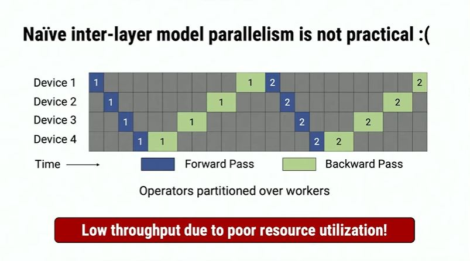

Naive inter-layer parallelism is an awkward idea of pipelining parallelism. The bubbles are too big, thus the throughput of a single GPU is very low.

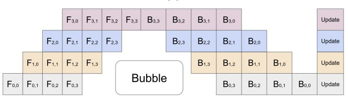

However, as is introduced in GPipe paper[[3](https://arxiv.org/pdf/1811.06965.pdf)], an inter-layer parallelism could increase the throughput if multiple batches are pushed into the pipeline. ($F_{ij}$ for forward pass, $B_{ij}$ for backward pass, $i$ for layer#, $j$ for batch#).

In Megatron-LM[[1](https://arxiv.org/pdf/2104.04473.pdf)], a smarter pipeline is introduced.

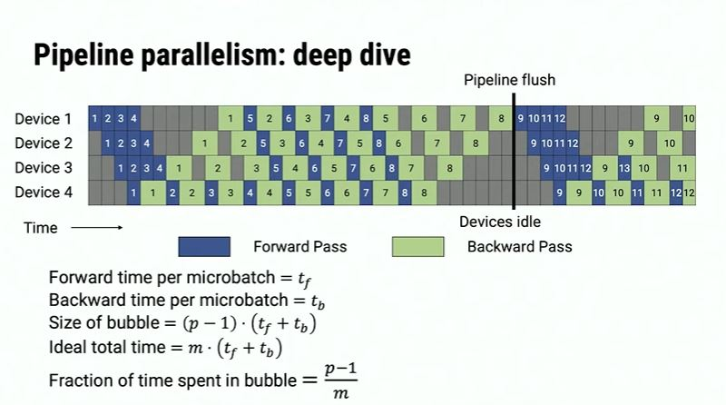

The great improvement is not an increase in throughput, but a reduction in memory requirements.  In the above example, device 4 could free its memory concerning the $1^{st}$ batch as soon as the $1^{st}$ forward step is finished. This is called *1F1B*(one forward pass followed by one backward pass). And the above schedule is *non-interleaved*.

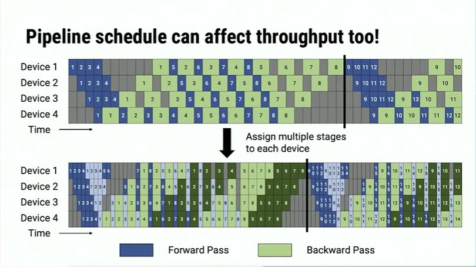

The model could also be *folded*, which means a single GPU can cope with multiple layers. This will enhance the throughput, as long as we organize the pipeline well. This is called *interleaved*.

#### Tensor Parallelism

##### Tensor 1D

To compute the tensor multiplication $Y=XA$, a naive way to parallelize it is to split it column-wise.
$$
\begin{pmatrix}
Y_1 &Y_2
\end{pmatrix} = X
\begin{pmatrix}
A_1 & A_2
\end{pmatrix}
$$
Another naive way is to split it row-wise.
$$
Y = 
\begin{pmatrix}
X_1 & X_2
\end{pmatrix}
\begin{pmatrix}
A_1 \\ A_2
\end{pmatrix}
$$
Both of them are naive, but when we combine them together, it becomes a super combination of 2-layer MLP.
$$
\begin{pmatrix}
Y_1 &Y_2
\end{pmatrix} = X
\begin{pmatrix}
A_1 & A_2
\end{pmatrix}
$$

$$
Z = 
\begin{pmatrix}
Y_1 &Y_2
\end{pmatrix}
\begin{pmatrix}
B_1 \\ B_2
\end{pmatrix}
$$

Notice that self-attention layer simply do some linear transformations and one activation on the split multi-heads, it is the same as a linear layer. This is what Megatron-LM does for its transformer block and 2-layer MLP.

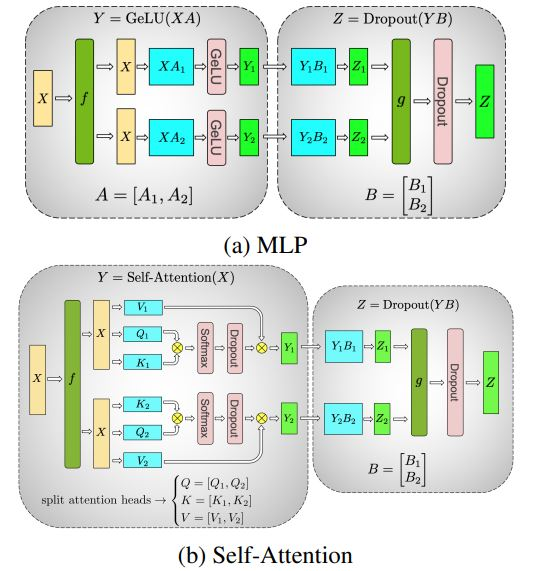

##### Tensor 2D

Optimus [[4](https://arxiv.org/pdf/2104.05343.pdf)] is stronger than Megatron because the tensor multiplication is improved using 2D parallelism. I am not familiar with the communication cost, but the SUMMA has better isoefficiency(?).

SUMMA optimize the matrix multiplication $C=AB$ as follows. The host scatter one row of $A$ and one column of $B$ respectively to compute the outer product. Then the devices gather the tensor back to the host to compute an aggregation.
$$
C = 
\begin{pmatrix}
A_1 \\ A_2 \\ \cdots \\ A_n
\end{pmatrix}
\begin{pmatrix}
B_1^T & B_2^T & \cdots & B_n^T
\end{pmatrix} = A_1 B_1^T + A_2 B_2^T + \cdots + A_n B_n^T
$$
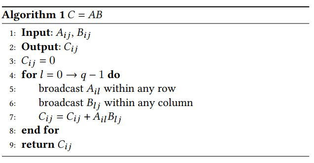

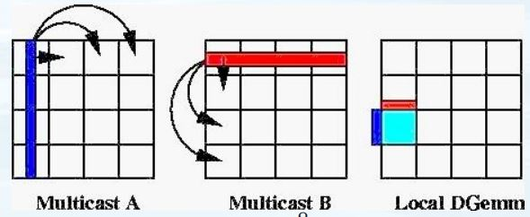

 $C=AB^T$ is different. Mark 
$$
B=\begin{pmatrix}B_1^T\\B_2^T\\\vdots\\B_n^T\end{pmatrix}
$$
Therefore, 
$$
C = \begin{pmatrix}
C_1 & C_2 & \cdots & C_n
\end{pmatrix} = 
A
\begin{pmatrix}
B_1 & B_2 & \cdots & B_n
\end{pmatrix} = 
\begin{pmatrix}
AB_1 & AB_2 & \cdots & AB_n
\end{pmatrix}
$$

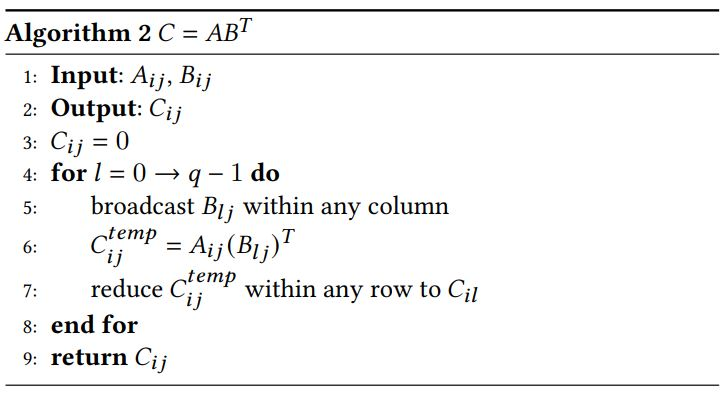

The block-wise parallelism is even more powerful. It could apply pipeline to the SUMMA algorithm.

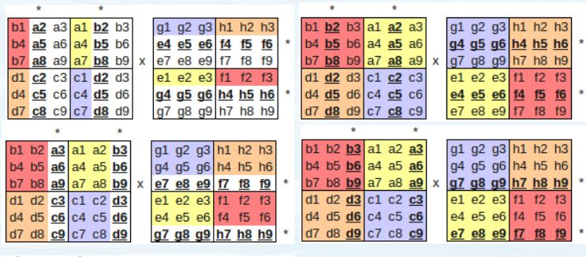

What is done in MLP can also be done in transformer. ($h$ for hidden size, $b$ for batch size, q for # of GPUs).

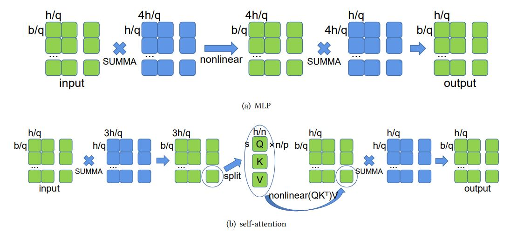

##### Tensor 2.5D/3D

I find it hard to explain why.

#### Use Colossal-AI

See docs [[9](https://colossalai.org/docs/basics/define_your_config)]. Here is the example of training BERT on 2 GPUs.

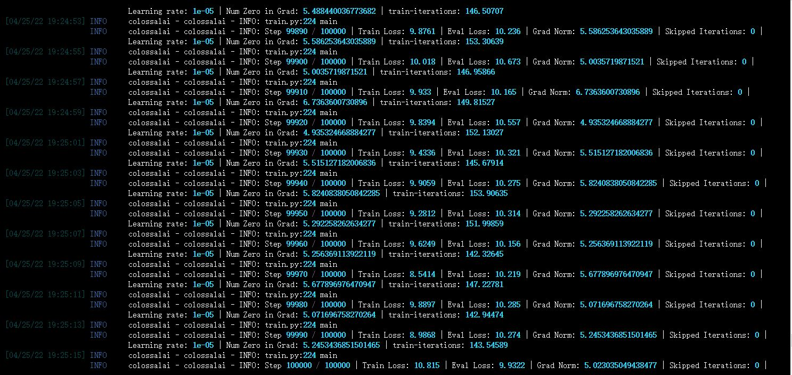

The BERT[[6](https://arxiv.org/pdf/2105.13120.pdf)] uses sequence parallelism, which enables long sequence training. This is easy to understand, as the sequence is split into several subsequences for training. 

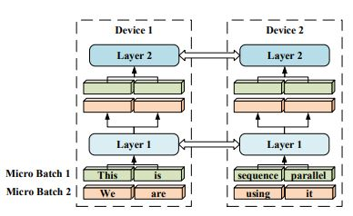

Each device GPU#i will be scattered with one subsequence of {query, key, value}$^i$, and a transmitting is required to *all-gather* the ${Q, K, V}$ as a whole. 

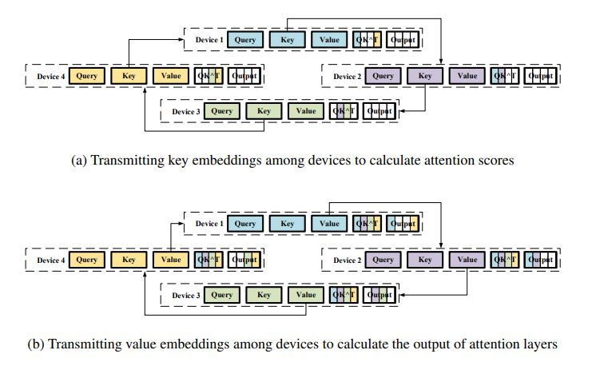

------

##### Reference:

1. Efficient Large-Scale Language Model Training on GPU Clusters Using Megatron-LM. https://arxiv.org/pdf/2104.04473.pdf (Youtube: https://www.youtube.com/watch?v=MO_CESBOXgo)
2. Megatron-LM: Training Multi-Billion Parameter Language Models Using Model Parallelism. https://arxiv.org/pdf/1909.08053.pdf
3. GPipe: Easy Scaling with Micro-Batch Pipeline Parallelism. https://arxiv.org/pdf/1811.06965.pdf
4. An Efficient 2D Method for Training Super-Large Deep Learning Models. https://arxiv.org/pdf/2104.05343.pdf
5. 2.5-dimensional distributed model training. https://arxiv.org/pdf/2105.14500.pdf
6. Sequence Parallelism: Long Sequence Training from System Perspective. https://arxiv.org/pdf/2105.13120.pdf
7. https://zhuanlan.zhihu.com/p/366906920\
8. https://cseweb.ucsd.edu/classes/sp11/cse262-a/Lectures/262-pres1-hal.pdf
9. https://colossalai.org/docs/basics/define_your_config
