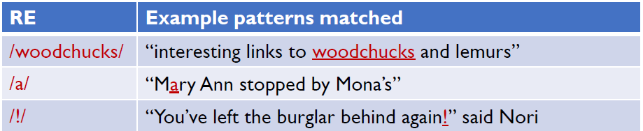
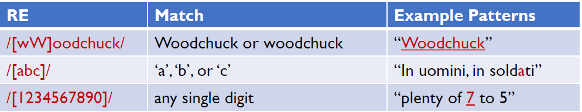
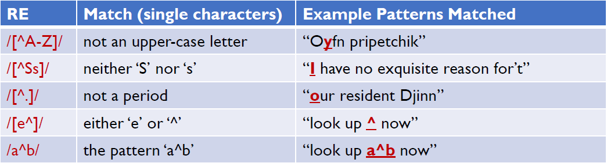
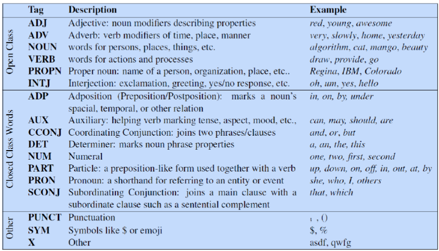
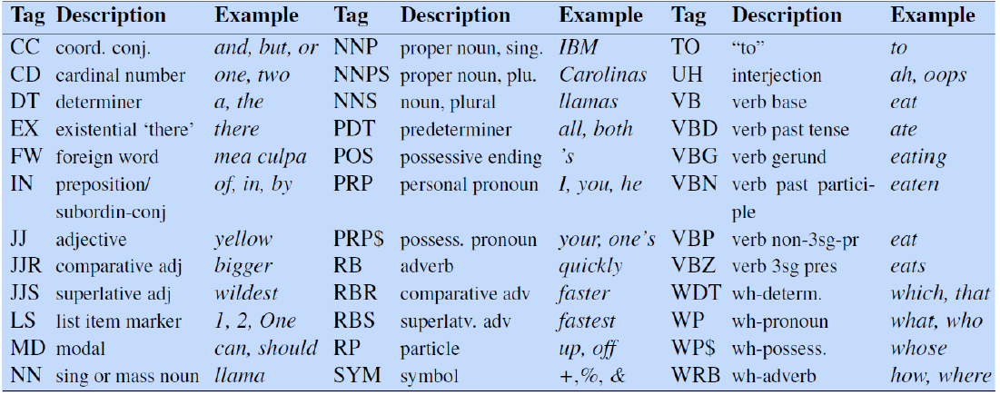
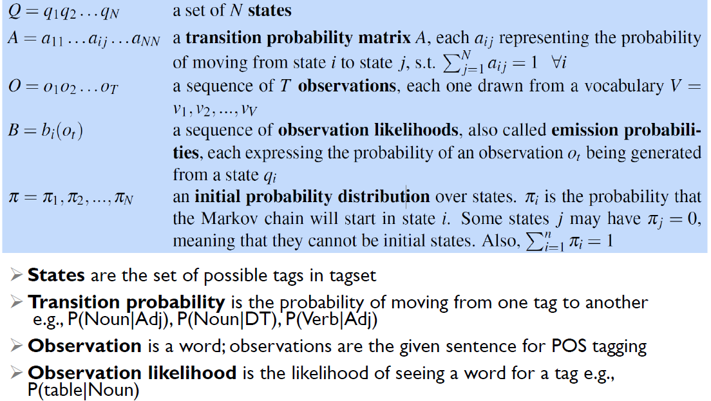
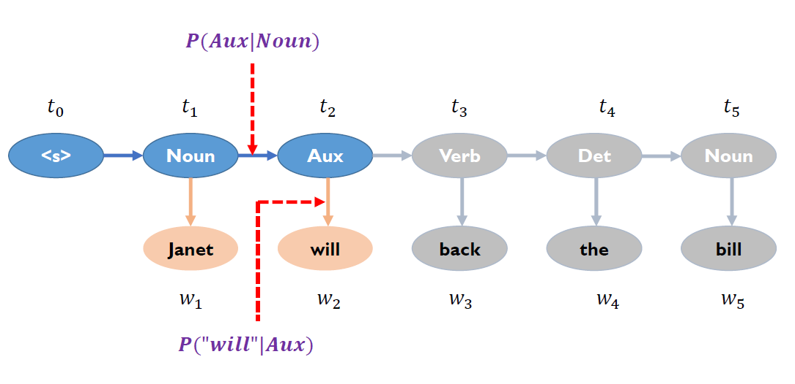
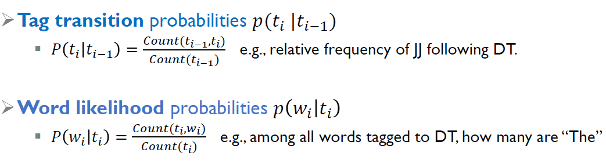
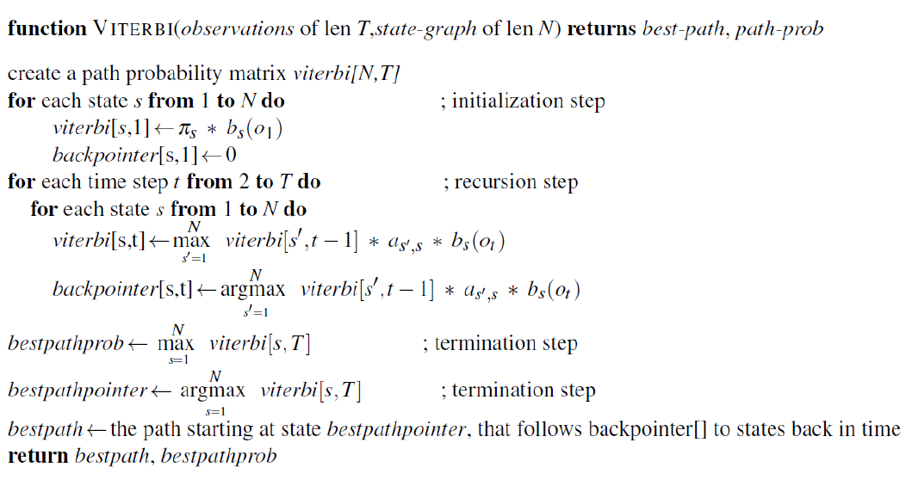

## Regular Expression (RE)

- RE is a language for specifying text search strings.

- Usage:

  - **Concatenation**

    - The simplest RE is a sequence of simple characters , like /test/
    - Putting characters in sequence is called **concatenation**.

    

  - **Disjunction** []

    - Square brackets [ ] matches any single character from within the class
    - Like /[wW]oodchuck/,  /[A-Z]/

    

  - **Negation** ^

    - If the caret ^ is the first symbol after the open square brace [, the resulting
      pattern is negated.

    

  - **Counters** ?*+
    - Question mark ? matches zero or one appearance of the preceding item
    - Kleene *(generally pronounced cleany star”) matches zero or more occurrences of the immediately previous character or regular expression
    - Kleene + matches one or more occurrences of the immediately preceding character or regular expression.

  - **Wildcard** .
    - The period (/./) is a wildcard expression that matches any single character (except a carriage return), e.g., /beg.n/ matches begin , beg’n , begun
  - **Anchors** ^$
    - The caret ^ matches the start of a line
    - The dollar sign $ matches the end of a line
  - **Word Boundary** \b \B
    - A “word” for the purposes of a regular expression is defined as any sequence of digits , underscores , or letters , based on the definition of “words” in programming languages.
  - **Disjunction** |

- Operator precedence

  - Parenthesis ()
  - Counters * + ? {}
  - Sequences and anchors
  - Disjunction |

- The whole process is to fix two kinds of errors:

  - False positives: strings that we incorrectly matched
  - False negatives: strings that we incorrectly missed

## Text Normalization and Edit Distance

## Parts of Speech and Named Entities

- Parts of speech (POS) refers to word classes such as Noun, Verb, Adjective, etc.

  

  - Closed classes are those with relatively fixed membership , such as prepositions; new prepositions are rarely coined
  - Nouns and verbs are among open classes new nouns and verbs like iPhone or fax are continually being created or borrowed
  

  - POS tagging is challenging

    - Words are **ambiguous**

- POS Tagging with **Hidden Markov Model (HMM)**

  

  - Objective:  $\hat{t}_{1:n} = \mathrm{argmax}_{t_{1:n}}P(t_{1:n}|w_{1:n})$

  - Transformation: 
    $$
    \hat{t}_{1: n}=\arg \max _{t_{1: n}} P\left(t_{1: n} \mid w_{1: n}\right)=\arg \max _{t_{1: n}} \frac{P\left(w_{1: n} \mid t_{1: n}\right) P\left(t_{1: n}\right)}{P\left(w_{1: n}\right)}
    $$

  $$
  \approx \arg \max _{t_{1: n}} \boldsymbol{P}\left(\boldsymbol{w}_{1: n} \mid \boldsymbol{t}_{1: n}\right) \boldsymbol{P}\left(\boldsymbol{t}_{1: n}\right)
  $$

  

  

- **Viterbi Algorithm**

  

- Named entity is proper name for person, location, organization, etc.